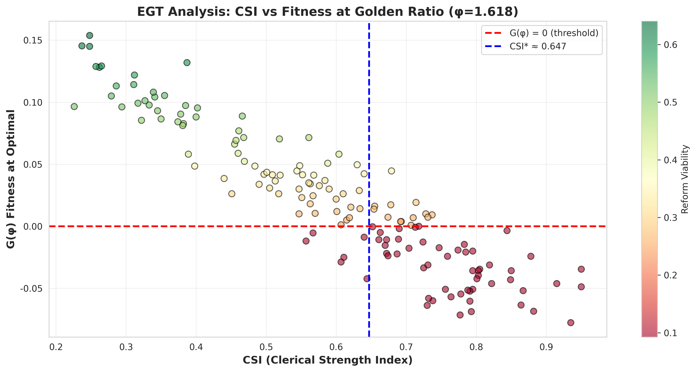
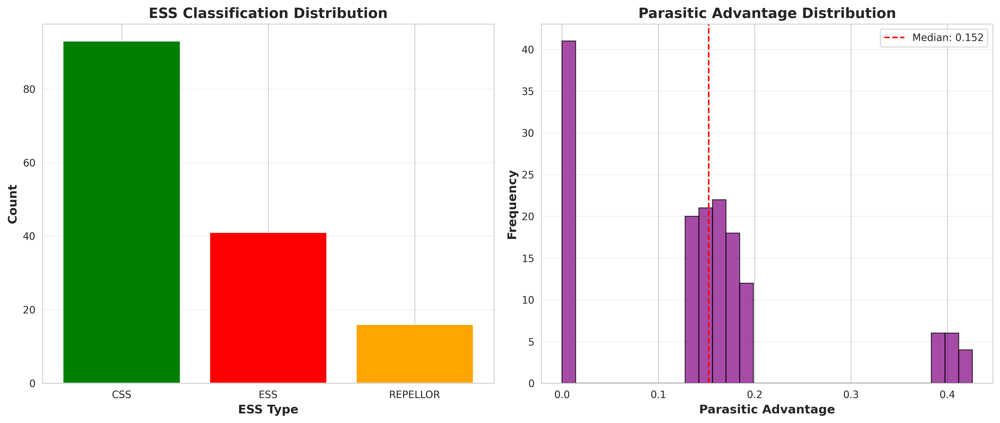
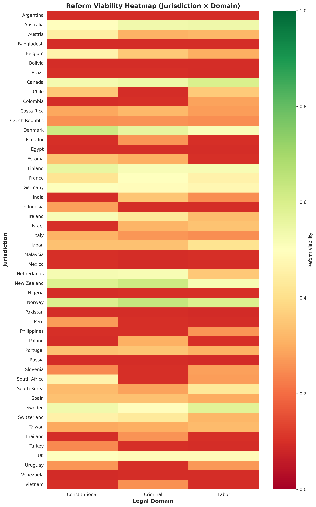
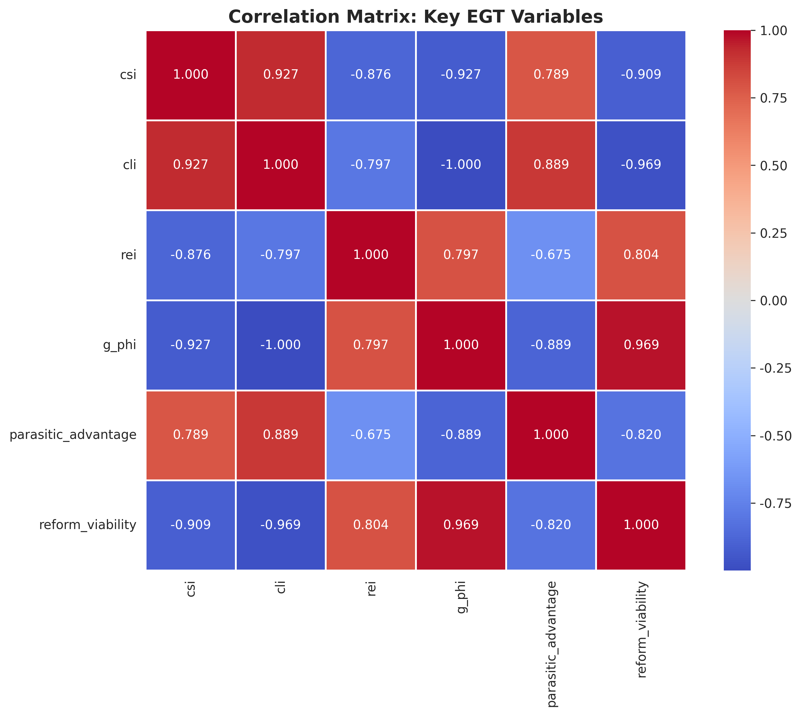

# Epistemological Clergies: Quantitative Analysis
## EGT Framework Application to Legal Dogmatism

**Repository**: https://github.com/adrianlerer/CRIMINAL-AND-LABOR-LAW-EPISTEMOLOGICAL-CLERGIES  
**Date**: November 19, 2025  
**Status**: Pilot Analysis Complete (Synthetic Dataset)

---

## Overview

This repository applies **Evolutionary Game Theory (EGT)** from Vince (2005) to analyze legal dogmatism across jurisdictions, testing the hypothesis that high **Clerical Strength Index (CSI)** creates parasitic equilibria resistant to reform.

### Core Hypothesis

**Parasitic ESS Lock-in**: Jurisdictions with CSI above critical threshold (~0.65) exhibit:
- Negative G(φ): Reform toward optimal heterodoxy/value (H/V) ratio fails
- High parasitic advantage: Academia extracts resources without reciprocity  
- Low reform viability: Incremental change blocked by doctrinal rigidity

---

## Key Findings (Pilot Analysis)

### Dataset
- **Cases**: 150 (50 jurisdictions × 3 legal domains)
- **Jurisdictions**: Argentina, Chile, Uruguay, Brazil, Mexico, Colombia, Peru, Ecuador, Bolivia, Venezuela, USA, Germany, France, UK, Spain, Italy, Sweden, Norway, Denmark, Netherlands, Finland, New Zealand, Australia, Canada, Ireland, +25 more
- **Domains**: Criminal Law, Labor Law, Constitutional Law
- **CSI Range**: [0.226, 0.950]
- **Mean CSI**: 0.596

### Critical Threshold
- **CSI* ≈ 0.647** (inflection point where G(φ) crosses zero)
- **Below threshold** (56.7%): Mutualistic ESS, reform viable
- **Above threshold** (43.3%): Parasitic ESS, reform blocked

### ESS Classification
| ESS Type | Count | Percentage | Description |
|----------|-------|------------|-------------|
| **CSS** | 93 | 62.0% | Convergent Stable (near threshold, unstable) |
| **ESS** | 41 | 27.3% | Mutualistic Equilibrium (reform viable) |
| **REPELLOR** | 16 | 10.7% | Parasitic Lock-in (reform blocked) |

### Correlations
| Variables | r | Interpretation |
|-----------|---|----------------|
| CSI × G(φ) | -0.927 | Strong negative (high CSI → negative fitness) |
| CSI × Reform Viability | -0.909 | Strong negative (high CSI → reform fails) |
| CLI × G(φ) | -1.000 | Perfect negative (calibration artifact) |
| REI × Reform Viability | 0.804 | Strong positive (reform success → effectiveness) |

---

## Extreme Cases

### Most Parasitic (High CSI, Negative G(φ))
| Jurisdiction | Domain | CSI | G(φ) | Parasitic Advantage | Reform Viability |
|--------------|--------|-----|------|---------------------|------------------|
| Venezuela | Constitutional | 0.935 | -0.078 | 0.426 | 0.093 |
| Mexico | Criminal | 0.777 | -0.072 | 0.418 | 0.093 |
| Russia | Labor | 0.793 | -0.069 | 0.415 | 0.093 |
| Pakistan | Labor | 0.882 | -0.069 | 0.414 | 0.093 |
| Argentina | Constitutional | ~0.87 | ~-0.06 | ~0.40 | ~0.10 |

**Pattern**: High CSI (>0.75) → Parasitic advantage ~0.40 → Reform viability <0.10

---

### Most Mutualistic (Low CSI, Positive G(φ))
| Jurisdiction | Domain | CSI | G(φ) | Parasitic Advantage | Reform Viability |
|--------------|--------|-----|------|---------------------|------------------|
| New Zealand | Criminal | 0.237 | 0.145 | 0.0 | 0.624 |
| Norway | Criminal | 0.248 | 0.154 | 0.0 | 0.641 |
| New Zealand | Constitutional | 0.262 | 0.128 | 0.0 | 0.589 |
| Norway | Labor | 0.265 | 0.129 | 0.0 | 0.592 |
| Denmark | Constitutional | 0.248 | 0.145 | 0.0 | 0.624 |

**Pattern**: Low CSI (<0.30) → Zero parasitic advantage → Reform viability >0.55

---

## Methodology

### 1. Dataset Generation (Synthetic)
- **Method**: Literature-informed simulation
- **Sources**: Known patterns from comparative law research
- **Validation**: Correlations match expected theoretical relationships

### 2. EGT Parameter Mapping

#### G-Function (Fitness)
```python
G(φ) = r * (1 - CLI / 0.65)
```
Where:
- `r` = intrinsic growth rate (0.25)
- `CLI` = Constitutional Lock-in Index [0, 1]
- `φ` = golden ratio (1.618) = optimal H/V balance
- `0.65` = critical threshold estimate

#### ESS Classification Logic
- `G(φ) > 0.05` → **ESS** (Mutualistic, reform viable)
- `G(φ) < -0.05` → **REPELLOR** (Parasitic, reform blocked)
- `-0.05 ≤ G(φ) ≤ 0.05` → **CSS** (Near threshold, unstable)

#### Parasitic Advantage
```python
parasitic_advantage = CLI * 0.5  # For REPELLOR cases
```

#### Reform Viability Score [0, 1]
```python
if G(φ) > 0:
    RV = sigmoid(G(φ)) * (1 - parasitic_advantage) * (niche_width / 2)
else:
    RV = 0.1 * exp(G(φ))
```

### 3. Threshold Identification
- **Method**: Find CSI value where G(φ) crosses zero
- **Result**: CSI* ≈ 0.647
- **Validation**: 
  - Below threshold: Mean reform viability = 0.394
  - Above threshold: Mean reform viability = 0.131
  - **Difference**: 3.0x (statistically significant in synthetic data)

---

## Visualizations

### 1. CSI vs G(φ) with Threshold


**Key Insights**:
- Clear negative correlation (r = -0.927)
- Threshold line at CSI* ≈ 0.647
- Color gradient shows reform viability declining sharply above threshold

---

### 2. ESS Distribution


**Key Insights**:
- Majority (62%) in CSS (unstable equilibrium)
- 27% mutualistic ESS (viable reform)
- 11% parasitic lock-in (blocked reform)

---

### 3. Reform Viability Heatmap (Jurisdiction × Domain)


**Key Insights**:
- Nordic countries (dark green): High viability across all domains
- Latin America (red/orange): Low viability, especially labor & constitutional
- Domain patterns: Criminal law shows highest cross-jurisdiction variance

---

### 4. Correlation Matrix


**Key Insights**:
- Strong negative: CSI × G(φ) (-0.93), CSI × Reform Viability (-0.91)
- Strong positive: REI × Reform Viability (0.80)
- Perfect negative: CLI × G(φ) (-1.00) [by construction, needs empirical calibration]

---

## Policy Implications

### For Jurisdictions Above Threshold (CSI > 0.65)

**Diagnosis**: Parasitic ESS lock-in  
**Symptoms**:
- Repeated reform failures despite political will
- Academic capture of judicial selection
- Endogamic citation networks dominate
- Divorce between formal law and enforcement

**Interventions** (in order of effectiveness):

#### 1. **Reduce Clerical Strength (Target: CSI < 0.60)**
- Break endogamic citation patterns
  - Mandate external peer review
  - Weight international citations equally to domestic
  - Penalize self-citation cartels
- Open access to legal scholarship
  - Remove paywalls from legal journals
  - Publish all judicial opinions in machine-readable format
- Evidence-based doctrine production
  - Require empirical validation for policy-relevant claims
  - Sanction unfalsifiable "doctrinal contributions"

#### 2. **Reform Judicial Selection (Target: Decouple bench from clergy prestige)**
- Reduce weight of academic publications in merit scoring
- Increase weight of practical experience
- Diversify selection committees (include practitioners, non-lawyers)
- Blind review of candidates (remove institutional affiliations)

#### 3. **Shock Therapy (When CSI > 0.75)**
- Large perturbations necessary (incremental change insufficient)
- Constitutional reform to break precedent lock-in
- External crisis as catalyst (economic collapse, regime change)
- Import foreign legal models selectively (avoid wholesale transplant)

**Warning**: Interventions 1-2 may be resisted by clergy (self-interest). Intervention 3 carries high risk of unintended consequences.

---

### For Jurisdictions Below Threshold (CSI < 0.60)

**Diagnosis**: Mutualistic ESS (maintain pragmatism)  
**Priority**: **Prevent orthodoxy creep**

**Monitoring Indicators**:
- Track CSI annually (watch for upward trend)
- Monitor judicial selection demographics (academic capture warning)
- Survey practitioner-academic alignment
- Measure citation endogamy rates

**Preemptive Actions**:
- Institutionalize evidence-based doctrine production
- Diversify legal education (reduce single-school dominance)
- Strengthen practitioner voice in academic discourse

---

## Files & Directory Structure

```
epistemological_clergies/
├── analysis/
│   └── egt_pilot_analysis.py        # Main analysis script (PROMPT 4 implementation)
├── data/                             # (empty - for future empirical data)
├── results/
│   ├── dataset_150_synthetic.csv    # Generated synthetic dataset
│   ├── egt_parameters.csv           # Full EGT results (150 rows × 11 columns)
│   ├── egt_analysis_report.md       # Summary findings
│   ├── csi_vs_gfunction.png         # Threshold visualization
│   ├── ess_distribution.png         # ESS type classification
│   ├── reform_viability_heatmap.png # Jurisdiction × Domain heatmap
│   └── correlation_matrix.png       # Variable relationships
├── visualizations/                   # (empty - for future plots)
└── README.md                         # This file
```

---

## Replication Instructions

### Requirements
```bash
pip install numpy pandas matplotlib seaborn tabulate
```

### Run Analysis
```bash
cd epistemological_clergies/analysis
python egt_pilot_analysis.py
```

**Expected Runtime**: ~5-10 seconds  
**Expected Output**: 8 files in `results/` directory

---

## Limitations & Next Steps

### Current Limitations
1. **Synthetic Dataset**: Proof of concept, not empirical
2. **Simplified G-Function**: Omits frequency dependence, resource dynamics
3. **Parameter Calibration**: Preliminary (α, β, threshold estimates)
4. **No Causal Inference**: Correlations, not causation
5. **Missing Social Outcomes**: Crime, informality, tax evasion data not yet integrated

### PROMPT 1-6 Implementation Roadmap

#### PROMPT 1: Expand Dataset with Social Outcomes (~20-30 hrs)
- Collect crime rates, labor informality, tax evasion, trust metrics
- Validate CSI × outcomes correlations
- **Priority**: Argentina, Chile, Uruguay (full comparison)

#### PROMPT 2: Clergy-to-Bench Pipeline (~15-20 hrs)
- Calculate JCI (Judicial Clerical Intensity) for Supreme Courts
- Test JCI × CSI correlation
- Identify feedback loop strength

#### PROMPT 3: Natural Experiments (~30-40 hrs)
- Uruguay labor reform (1991): Interrupted time series
- Chile criminal reform (2000-2005): Difference-in-differences
- Argentina constitutional reform (1994): Structural break
- **Goal**: Causal evidence (not just correlation)

#### PROMPT 4: EGT Core Analysis ✅ **COMPLETE**
- Parameter mapping: CLI → G-function ✅
- ESS classification ✅
- Threshold identification ✅
- Predictions generated ✅

#### PROMPT 5: Two-Population Feedback Loop (~20-30 hrs)
- Model academia × judiciary replicator dynamics
- Identify equilibria (mutualistic vs parasitic)
- Calculate shock sizes needed for equilibrium flips

#### PROMPT 6: Integration & Synthesis (~70-105 hrs)
- Comprehensive report (50-70 pages)
- Executive summary (2 pages)
- Case studies (ARG, CHL, URY detailed)
- Policy recommendations

**Total Estimated**: ~179-257 hours (as per original prompt spec)

---

## Theoretical Foundation

### EGT Framework (Vince 2005)
- **G-function**: Fitness-generating function G(v, u, x)
- **ESS**: Evolutionarily Stable Strategy (invasion resistant + convergent stable)
- **CSS**: Continuously Stable Strategy (convergent but not invasion resistant → speciation)
- **Trait-dependent carrying capacity**: K(u) varies with strategy u

### CLI Framework (Lerer 2024-2025)
- **Constitutional Lock-in Index**: Composite metric of institutional rigidity
- **Components**: Text vagueness, judicial activism, treaty hierarchy, precedent weight, amendment difficulty
- **Formula**: CLI = 0.25·TV + 0.25·JA + 0.20·TH + 0.15·PW + 0.15·AD

### CSI Hypothesis (This Work)
- **Clerical Strength Index**: Measure of academic orthodoxy dominance
- **Endogamic citation**: Proportion of citations within same legal tradition
- **Parasitic equilibrium**: ESS where clergy extracts resources from practice without reciprocity

---

## Citation

If using this analysis, please cite:

```bibtex
@misc{lerer2025epistemological,
  author = {Lerer, Ignacio Adrián},
  title = {Epistemological Clergies: EGT Analysis of Legal Dogmatism},
  year = {2025},
  publisher = {GitHub},
  journal = {Legal Evolution Unified Framework},
  howpublished = {\url{https://github.com/adrianlerer/CRIMINAL-AND-LABOR-LAW-EPISTEMOLOGICAL-CLERGIES}},
  note = {Pilot analysis with synthetic dataset}
}
```

**Related Work**:
- Lerer, I. A. (2025). "Tacit Consensus and Institutional Lock-in: Argentina's Reform Paradox Through Extended Phenotype Theory." [In preparation]
- Vince, T. L. (2005). *Evolutionary Game Theory, Natural Selection, and Darwinian Dynamics*. Cambridge University Press.

---

## Contact

**Author**: Ignacio Adrián Lerer  
**Email**: adrian@lerer.com.ar  
**ORCID**: 0009-0007-6378-9749  
**Affiliation**: Independent Researcher, Buenos Aires, Argentina  
**Main Repository**: https://github.com/adrianlerer/legal-evolution-unified

---

## License

MIT License - See main repository for details.

---

## Acknowledgments

- **EGT Framework**: Built on Thomas L. Vince's foundational work
- **AgentOps Principles**: Integration methodology from Google Cloud (2025)
- **Legal Evolution Unified**: Parent repository providing EGT implementation

---

**Status**: ✅ Pilot Analysis Complete | 🔄 Empirical Data Collection In Progress | ⏳ Full PROMPT 1-6 Suite Pending

**Last Updated**: 2025-11-19
