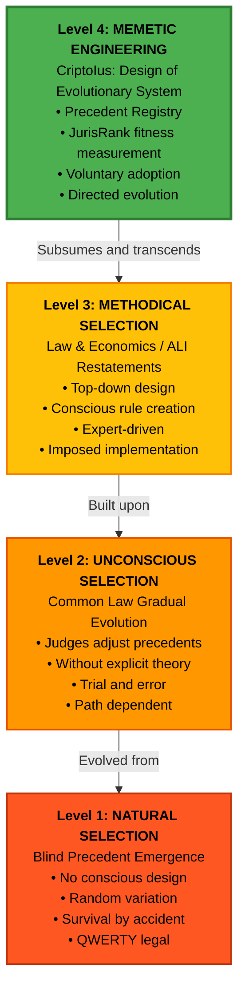

# Figure 1: Four Levels of Legal Evolution (Dennett Framework)

## Mermaid Diagram

## Key Insights

**Level 1 → 2:** Transition from blind evolution to unconscious optimization
- Example: Medieval common law judges gradually refined contract doctrines without theoretical framework
- Problem: Slow, prone to lock-in

**Level 2 → 3:** Transition from unconscious to conscious design
- Example: Law & Economics movement designs efficient rules explicitly
- Problem: Top-down, lacks evolutionary adaptation

**Level 3 → 4:** Transition from rule design to system design
- Example: CriptoIus doesn't impose precedents; it designs the SYSTEM that allows efficient precedents to evolve voluntarily
- Innovation: **Memetic engineering** - designing evolutionary mechanisms themselves

## Dennett Quote (Freedom Evolves, p. 298)

> "The ingeniería memética is a very recent innovation in the history of evolution on this planet... some of its first and most celebrated products were Plato's Republic and Aristotle's Politics."

## Application to CriptoIus

CriptoIus represents the **first implementation of Level 4 in legal systems**:
- Not designing specific precedents (that would be Level 3)
- Designing the **evolutionary system** itself
- JurisRank measures fitness
- Parties act as distributed selection agents
- Precedents evolve toward efficiency through voluntary adoption

## Citation

**Source:** Dennett, D. (2003). *La Evolución de la Libertad*, pp. 297-298. Barcelona: Paidós.

**Analogous to:** Darwin's four levels of genetic selection (natural → unconscious → methodical → genetic engineering)
