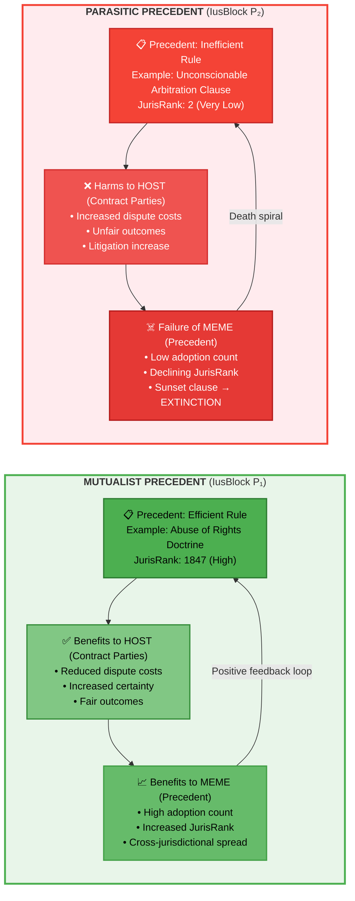

# Figure 2: Precedents as Memetic Symbionts (Mutualist vs Parasite)

## Mermaid Diagram

## Dennett's Trichotomy of Memes

### 1. Parasitic Memes
- **Harm host** while replicating
- Examples: Conspiracy theories, exploitative legal doctrines
- CriptoIus: Low JurisRank precedents that increase litigation costs

### 2. Commensal Memes  
- **Neutral to host**
- Examples: Arbitrary conventions (e.g., default currency)
- CriptoIus: Moderate JurisRank, regional adoption only

### 3. Mutualistic Memes
- **Benefit host** while replicating
- Examples: Useful knowledge, efficient legal interpretations
- CriptoIus: High JurisRank precedents that reduce dispute costs

## Cui Bono? (Who Benefits?)

> "In the realm of memes, the ultimate beneficiary... is the meme itself, not its carriers." - Dennett (2003, p. 203)

### But CriptoIus Aligns Interests

**Traditional Precedent:** Can persist even if parasitic (stare decisis inertia, path dependence)

**CriptoIus Innovation:** System designed to favor **mutualists** and extinguish **parasites**

- **Mutualist Precedent** = High JurisRank (both meme AND host benefit)
- **Parasitic Precedent** = Low JurisRank (meme tries to replicate but host rejects) → Sunset clause triggers EXTINCTION

## Measurement Metrics

| Precedent Type | JurisRank Score | Adoption Count | Litigation Rate | Fairness Score | Outcome |
|----------------|-----------------|----------------|-----------------|----------------|---------|
| **Mutualist** | 1000+ | High | Low | 0.85+ | Spreads exponentially |
| **Commensal** | 200-800 | Moderate | Neutral | 0.50-0.80 | Survives in niche |
| **Parasitic** | <100 | Very Low | High | <0.30 | Goes extinct |

## Example: Cueto Rúa Convergence (Mutualist Precedent)

**Louisiana & Continental Europe: Abuse of Rights Doctrine**

- **Harm prevented:** Parasitic litigation (malicious exercise of formal rights)
- **Benefits to parties:** Reduced costs + maintained contractual liberty
- **Benefits to precedent:** Replicated across 5+ independent jurisdictions
- **Result:** JurisRank 1847 (near-universal adoption)

This is **convergent evolution** - same mutualistic solution emerged independently because it **worked** (increased fitness for adopters).

## Citation

**Source:** Dennett, D. (2003). *La Evolución de la Libertad*, Cap. 6 "Memes como Simbiontes Culturales", pp. 202-204. Barcelona: Paidós.

**Key Concept:** Precedents are not passive data; they are active replicators competing for fitness through differential adoption rates.
